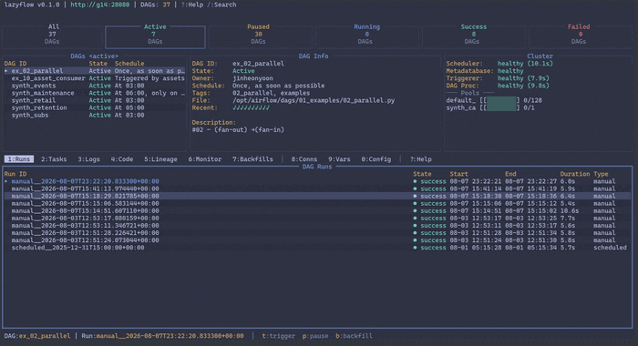

# Lazyflow

Lazyflow is a terminal UI designed to simplify and accelerate interactions with **Apache Airflow 3** clusters.



## Features

- **Cluster overview** — a KPI bar at the top shows cluster-wide DAG counts
  (Active / Paused / Running / Success / Failed) over a configurable rollup window.
- **DAG list** with live filtering (active / all / failed) and search.
- **Drill-down navigation** — DAG → run → task → logs. Picking a run turns the
  Tasks tab into a live run dashboard (summary, task list, detail, log preview,
  DAG graph, Gantt); `Esc` walks back up.
- **Ten tabs**: Runs, Tasks, Logs, Code, Lineage, Monitor, Backfills,
  Connections, Variables, Config — plus a Help keymap page.
- **Syntax highlighting** for DAG source, and colour-coded task logs
  (level, timestamp, logger, plus Rich markup printed by your DAGs).
- **Gantt & lineage graph** toggles for the Tasks and Lineage tabs.
- **DAG actions** — trigger, pause/unpause, and backfill straight from the UI.
- **Backfill management** — pause, unpause, and cancel running backfills.
- **Cluster / pool panel** with a compact-vs-table view toggle.
- **Auto-refresh** with per-resource intervals; manual refresh on demand.

## Installation

### Prerequisites

- Go 1.25 or higher
- (Optional) [`just`](https://github.com/casey/just) as the task runner

### Build from Source

1. Clone the repository:
   ```bash
   git clone https://github.com/yjinheon/lazyflow.git
   cd lazyflow
   ```

2. Build the binary:
   ```bash
   just build         # or: go build -o lazyflow ./cmd/lazyflow/
   ```

3. Run the application:
   ```bash
   just run           # or: ./lazyflow
   
   ```

Common `just` tasks: `build`, `run`, `dev` (build + run), `test`, `lint`, `tidy`, `clean`.

## Configuration

Lazyflow talks to Airflow's REST API v2 and manages JWT auth internally, so it
only needs a base URL and credentials.

Config is loaded in this precedence order (later sources win):

1. `configs/default.yaml` (project-local), if present
2. `~/.config/lazyflow/config.yaml`
3. Environment overrides (always win):
   `AIRFLOW_BASE_URL`, `AIRFLOW_USERNAME`, `AIRFLOW_PASSWORD`,
   `AIRFLOW_TOKEN` (setting a token forces auth type to `token`)

Example `configs/default.yaml`:

```yaml
airflow:
  base_url: 'http://localhost:28080'
  timeout: '30s'
  auth:
    type: basic            # "basic" or "token"
    username: 'airflow'
    password: 'airflow'

ui:
  theme: dark
  refresh_intervals:
    dags: '5s'
    runs: '3s'
    tasks: '2s'
    logs: '1s'
    health: '10s'
  # Lookback window for the cluster KPI bar + per-DAG run counts.
  # Go duration (max unit 'h'); 7 days = 168h, 14 days = 336h.
  rollup_window: '168h'
```

A runtime debug log is written to `lazyflow.log` in the working directory
(recreated on each launch).

## Keybindings

### Global

| Key | Action |
| --- | --- |
| Ctrl+C | Quit |
| F5 | Refresh |
| Esc | Back up one level (logs → tasks → runs); elsewhere, focus the DAG list |
| Tab / Shift+Tab | Cycle panels: DAG list → filters → DAG info → cluster → active tab |
| / | Search DAGs |
| ? | Show help keymap |

### Tabs

Number keys work anywhere, including inside a run drill-down.

| Key | View |
| --- | --- |
| 1 | Runs |
| 2 | Tasks (run dashboard when a run is selected) |
| 3 | Logs |
| 4 | Code |
| 5 | Lineage |
| 6 | Monitor |
| 7 | Backfills |
| 8 | Connections |
| 9 | Variables |
| 0 | Config |
| B | Backfills (alias) |
| g | Toggle Tasks gantt / Lineage graph |
| Shift+← / Shift+→ | Previous / next tab |
| < / > | Previous / next tab (for terminals that swallow Shift+arrows) |

### Navigation

Bare arrow keys belong to the focused widget, so only Shift+arrow cycles tabs.

| Key | Action |
| --- | --- |
| j / k · ↑ / ↓ | Move up / down |
| h / l · ← / → | Scroll columns left / right |
| g / G | Jump to top / bottom (outside the Tasks and Lineage tabs) |
| PgUp / PgDn | Page up / down |
| Enter | Select / drill down |

### DAG Actions

| Key | Action |
| --- | --- |
| t | Trigger selected DAG run |
| p | Pause / unpause selected DAG |
| b | Backfill selected DAG |

### Backfill Actions (Backfills tab)

| Key | Action |
| --- | --- |
| p / u | Pause / unpause selected backfill |
| c | Cancel selected backfill |

### Monitor Tab

| Key | Action |
| --- | --- |
| [ / ] | Previous / next time window |
| r | Refresh dashboard |

### DAG Filters

| Key | Action |
| --- | --- |
| a | Active DAGs only |
| A | All DAGs |
| f | Failed DAGs only |
| ← / → on the KPI bar | All / active / paused / run-state filters |

### Focus

| Key | Action |
| --- | --- |
| d | Focus DAG list |
| i | Focus DAG info panel (scrollable) |
| o | Focus cluster panel (press again to toggle pool compact/table) |

### Modal Actions

| Key | Action |
| --- | --- |
| Esc | Close without running |
| Enter | Submit when focused outside a JSON text area |
| Ctrl+J / Ctrl+M | Submit from anywhere in the form |

## Acknowledgements

This project is inspired by kdash,k9s, and lazygit.

- https://github.com/kdash-rs/kdash
- https://github.com/derailed/k9s
- https://github.com/jesseduffield/lazygit
